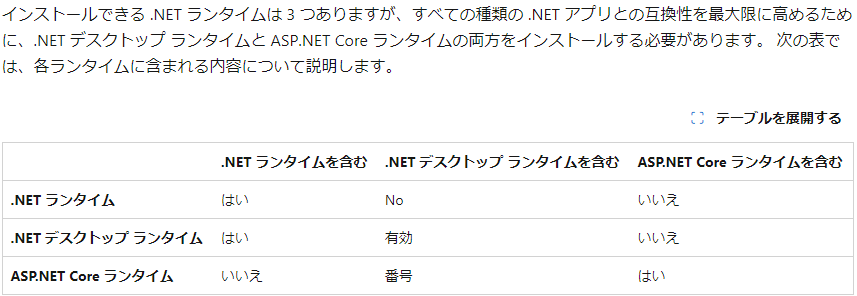
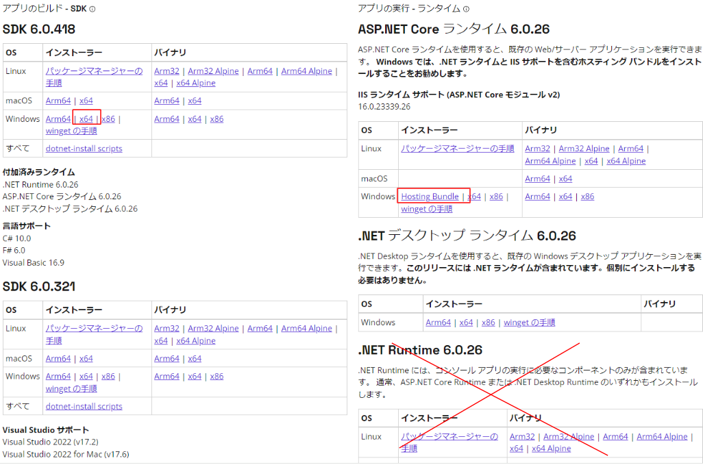

# ASP.NetCore IIS ホスティングマニュアル

## はじめに
VB.netの.netframeworkが主流の弊社でC#.netCoreとしてはで初めてWebAPIプロジェクトを作成しIISサーバーにデプロイする事になったので備忘録を兼ねマニュアル化します。  (久々に2度目に作業した際Moduleが足りず数時間ハマりました。。。)  
なお、本作業にサーバー自体の再起動は不要です。

## SDK、Runtimeのインストール
1. ソースの [.csproj] にて.netのバージョンを確認する

  
1. 対応したバージョンの［.ASPNetCore］用のランタイムとSDKをダウンロードする
- サーバーの再起動は不要です
- 【重要】NETRuntimeにはIISデプロイに必要な以下のcore用Moduleが含まれないため［ASP.netCore ランタイム］をダウンロードして下さい  
  必須module：［ASP.NET Core Module］のサーバへインストール  
   [ASP.netCore ランタイムのダウンロードはこちら ※donet6.0の場合](https://dotnet.microsoft.com/ja-jp/download/dotnet/6.0)　  

## WebConfigの設定
.netCoreのWebAPIプロジェクトのアプリケーション自体はAppsettings.jsonを使用するため、WebConfigを使用できませんがIISでホストする場合WebConfigで以下を定義する必要があります

- handlersタグ :［ASP.NET Core Module］がweb.configを読込み、自動的に設定してくれるため、手作業でIIS上でハンドラーマッピングの追加は不要
- aspNetCoreタグ：エントリーポイントとなるdll等を定義してください

［.web.config］
```
"<system.webServer>        
<handlers>        
<add name=""aspNetCore"" path=""*"" verb=""*"" modules=""AspNetCoreModuleV2"" resourceType=""Unspecified"" />        
</handlers>        
<aspNetCore processPath=""dotnet"" arguments="".\WebApplication1.dll"" stdoutLogEnabled=""false"" stdoutLogFile="".\logs\stdout"" hostingModel=""InProcess"" />        
</system.webServer> 
```

## 動作確認
一般的な手順でIISマネージャでサイト構築し動作を確認してください


## 参考
### 各ランタイムの構成は.netCore6.0の時点で以下の通りとなっています  



### 今回の対応SDKは以下の通りです 



