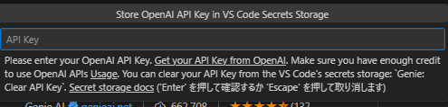

## はじめに
API連携は便利そうだと思いながらも手を出せていなかったので、とりあえずプライベートのVSCodeを連携させてみようと思います。
※ 本記事は2024年6月7日現在のものとなります。

## Developer quickstart
* [Developer quickstart はこちら](https://platform.openai.com/docs/quickstart)
以下をサポートしているとのことですがcurnelやPythonが対象でした
* 開発環境のセットアップ方法
* 最新SDKのインストール方法
* OpenAPIの基本機能の一部の紹介
* 最初のAPIリクエストの疎通方法

## アカウントの作成
ChatGPTやOpenAPIのページで作成すればOK。
今回社用利用とは別のGoogleアカウントで作成したところ誕生日入力程度だった。

## APIKey
[Create new secret key] >［認証用電話番号入力］＞［ワンタイム認証］
後APIKeyを取得できる
nameを入力し必ずこの場でAPIキーを控える
##### APIKeyは一度しか参照できません。キーを確認しに行くと***でマスキングされます
##### 外部に漏洩しない方法で管理してください（トークンが勝手に使用されてしまいます）

なお、chatGPTに計算してもらったところ約800,000文字程度が3か月の無料クレジット分だそうです。（変動します）

##### ［APIログインページURL］https://platform.openai.com/apps
##### ［APIKeyページURL］https://platform.openai.com/api-keys

## VSCodeに拡張機能を導入
- 拡張機能のアイコンから［ChatGPT-Genie AI］を選択しインストールします。
- 左端拡張機能やエクスプローラーのアイコンが格納されているサイドバーから［ChatGPT-Genie AI］を開きます
- 左下端の［Ask a question］から何か質問してみます

- APIKeyが求められるためAPIKeyを入力します


## 参考
#### 出典
[環境構築を参考にしたサイトはこちら](https://www.onamae.com/business/article/26878/)
[GenieAIの機能紹介がわかりやすいサイトはこちら](https://zenn.dev/tigrebiz/articles/vscode-genie-ai#genieai%E3%81%A7%E3%81%A7%E3%81%8D%E3%82%8B%E3%81%93%E3%81%A89%E3%81%A4)

#### 無料クレジットの利用例
※ Modelや入出力比率、時々の料金体系により変更となります。
```
無料トライアルで$18のクレジットが付与されると仮定します。

計算例
無料クレジット総量: $18

1,000トークンのコスト:

入力: $0.03
出力: $0.06
合計トークン数:

入力1,000トークン + 出力1,000トークン = $0.03 + $0.06 = $0.09
$18のクレジットで使用できるトークン数:

$18 / $0.09 ≈ 200,000トークン（合計）
1トークンあたりの文字数:

およそ4文字
無料クレジットで使用できる文字数:

200,000トークン * 4文字 ≈ 800,000文字
```