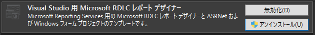
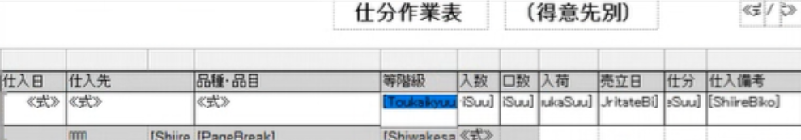
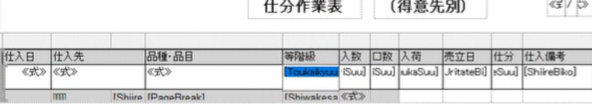
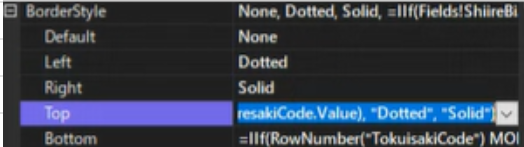
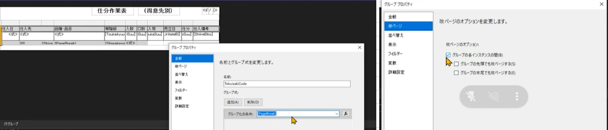

# Microsoft RDLC 操作マニュアル

## はじめに
Microsoft RDLCとはMicrosoft社が無償で提供しているMicrosoftReportService用の帳票作成ツールです。
本ツールに限らず帳票ソフト全般クセはありますし、高価な某帳票ソフトと機能的に遜色なく使えました。

## 導入方法
以下の環境を用意します。

IDE:VisualStuido 2005 以降
拡張機能：VisualStudio用 Microsoft RDLC レポートデザイナー

## 開発方法

### 編集対象ファイル
*.rdlc*Report.cs
    
### データバインド
1. ［表示］ ［レポートデータ］を押下しデータバインドを開始する
   - データセット一覧を確認できる ※クラス名のデータセットが構造体としてセットされている
2.  [*Report.cs] にプロパティを作成する
3. ［レポートデータ］ のプロパティを右クリックで更新する
    
### デザインの編集
- 基本事項
  - 基本的な項目はUIからvalueに設定できる  
  - 固定文字列は帳票デザイン自体に直接書き込む
    
- 動的な値の設定
  - valueの値にIIFの関数を使用すると動的に値を設定できる    
    ex.先頭行以外上部のデータと同じデータならデータを表示しない
’=IIf(RowNumber("TokuisakiCode") MOD 32 <> 1 AND Fields!ShiireBi.Value = Previous(Fields!ShiireBi.Value), Nothing, Fields!ShiireBi.Value)
    
- 選択モードの違い
      
| 罫線などデザインの設定ができるモード | バリュー等の設定が設定できるモード   |
| ---- | ---- |
|  |  |
    
- 罫線の設定
  - プロパティ［BorderStyle］から対応項目のvalueを選択し設定できる
  - 動的にIIFで設定も可能  
  ex. =IIf(Fields!ShiireBi.Value & Fields!ShiiresakiCode.Value = Previous(Fields!ShiireBi.Value) & Previous(Fields!ShiiresakiCode.Value), "Dotted", "Solid")

- 処理用行の設定
  - ［行を選択］し右クリック［行グループ］で グループ化の設定をできる  
  （例えば改ページなどに使用する） ※今回使用していないが親子グループも可能
  - プロパティから行を非表示に変更すると帳票出力の対象外となる

- ページ設定  
  - 隠し行に設定された値を使用してやる事が可能  
"""=Fields!PageBreak.Value name:PageBreak"""
ページ分子：=Code.GetGroupPageNumber(ReportItems!PageBreak.Value,Globals!PageNumber)
ページ分母：=Code.GetGroupPageTotal(ReportItems!RowNo.Value)
    
- 任意関数の作成
    ［何もない箇所を右クリック］［レポートのプロパティ］ 
    
## リリース準備
- rdlcのファイルプロパティ  
[ビルドアクション] ：コンテンツ  
[出力ディレクトリにコピー]：常にコピーする  
