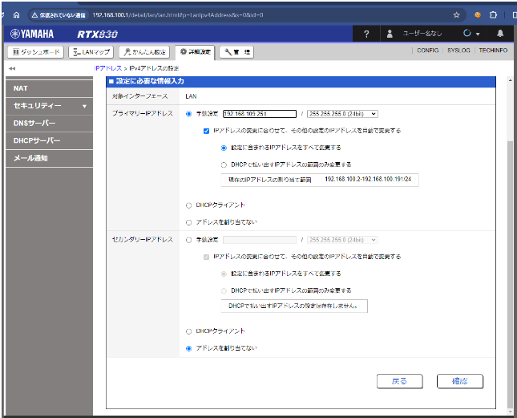

# Hyper-V 仮想機の複製

- [Hyper-V 仮想機の複製](#hyper-v-仮想機の複製)
- [コピー元ファイルの準備](#コピー元ファイルの準備)
- [コピー先で構築](#コピー先で構築)

## コピー元ファイルの準備
1. サーバー名［xxx］にリモート接続
1. hyper-vマネージャーを起動
1. コピーしたい仮想マシンを選択
1. 右クリック->シャットダウン
1. シャットダウン後、仮想マシンを右クリック->設定
1. ハードドライブのパスをコピーしてエクスプローラーで開く
1. vhdxファイルをコピー

## コピー先で構築
1. 空き容量に余裕があるドライブにフォルダを作成(vhdxファイル格納場所)
1. vhdxフィル貼り付け
1. vhdxファイル名変更(作成予定のマシン名にする)
1. 例）kakinet-dev-13.vhdx -> kakinetdev6.vhdx
1. hyper-vマネージャー->サーバ名右クリック->新規->仮想マシン
1. 作成画面で以下を設定
- 名前と場所の指定
- 名前:vhdxファイル名、場所:格納先を設定
- 世代の指定
- 世代:コピーしてきたvhdxファイルと同じにする。
- メモリの割り当て
- メモリは特に指定なし (作成時3072MB設定)
- ネットの構成
- 接続のリストボックスのデフォルトアダプタを選択
- 仮想ハードディスクの接続
- 「既存の仮想ハードディスクを使用する」を選択しコピーしたvhdxファイルを選択
1. 「完了」をクリックして作成
1. 作成した仮想マシンを右クリック->設定
1. 以下のように設定を変更  
   <例>
- bios ideを上に移動
- チェックポイントを無効
- 自動開始アクション:デフォルト（自動起動）
- 自動停止アクション:シャットダウン
  

  

2. 仮想マシン右クリック->起動->接続
3. パソコン名変更(ファイル名と同じにする)
4.  IPを確認
5.  ローカルからリモート接続
