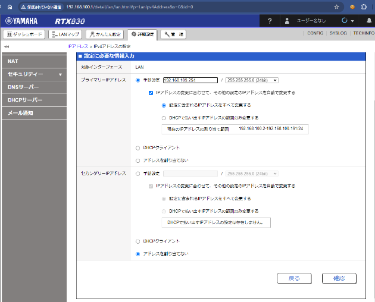
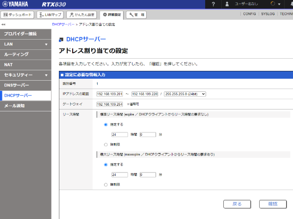
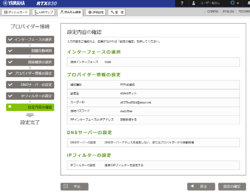
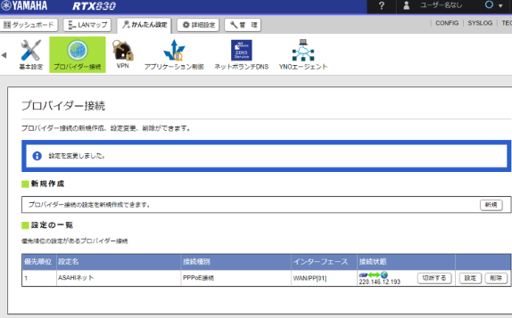
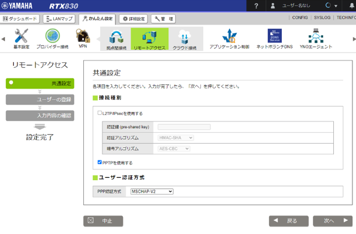
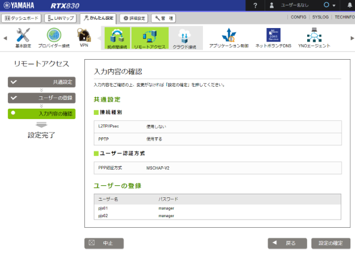

# ネットワーク設定マニュアル

- [ネットワーク設定マニュアル](#ネットワーク設定マニュアル)
  - [はじめに](#はじめに)
    - [前提](#前提)
    - [注意事項](#注意事項)
  - [機器の接続](#機器の接続)
  - [設定ページへアクセス](#設定ページへアクセス)
  - [DHCPサーバーの変更　※画像1,2](#dhcpサーバーの変更画像12)
  - [プロバイダ設定　※画像3,4](#プロバイダ設定画像34)
    - [トラブルシューティング：大きく２ケース](#トラブルシューティング大きく２ケース)
  - [ネットボランチDNS](#ネットボランチdns)
  - [VPN設定　※画像5,6](#vpn設定画像56)
    - [［L2TP］](#l2tp)
    - [［PPTP］](#pptp)
    - [［PPTP接続方法］](#pptp接続方法)
  - [クライアント側からのVPNの設定](#クライアント側からのvpnの設定)
  - [管理コンソール](#管理コンソール)
  - [参考画像](#参考画像)
    - [※画像１](#画像１)
    - [※画像2](#画像2)
    - [※画像3](#画像3)
    - [※画像4](#画像4)
    - [※画像5](#画像5)
    - [※画像6](#画像6)

## はじめに
### 前提
1. お客様環境にONUがある事
1. プロバイダ情報を取得しておくこと
1. ネットワークセグメントの確認
1. 使用済みの固定IP

  
### 注意事項
- ONUとルーターはUPSからとった方がよい
- ルーターの設定を行う時に使用するクライアント端末のwifiは切断する事
- Configをテキストファイルで保存しNAS等に保存しておくこと：復元時読込み可能
- 新品のルーター以外は設定前に初期化する事

## 機器の接続
- ONUからWANにさす事で光のセッションを使用できる
- 光のセッションは通常契約では２セッションまでHubを介する事で複数セッション使用できる
- 192.168.100.1がYAMAHAルーターの初期アドレスでPCにはxx100.2がDHCPで振られる
- 以下の通り接続する  
  ［ONU］ー［HUB］ー［Rooter］－［PC］

## 設定ページへアクセス 
- ブラウザでルーターIPを叩く ユーザー名Passはなしでよい
- IPの設定でセグメントを変更する　※画像1
- DHCP設定のセグメントも確認し変更する
- LANケーブルを抜き差しするとIPが更新される

## DHCPサーバーの変更　※画像1,2
- DHCPサーバーの変更で範囲を設定する ex.xx109.201 - xx109.220　
- ゲートウェイは省略可だが、2つある場合もあるでどちらのゲートウェイか明示するためルーターのIPを入力する
- リース時間：一度IPを配信して標準で72時間IPを固定する
  → 24時間で指定することが多い
- DHCPの割り当て数と使用数は確認可能

## プロバイダ設定　※画像3,4
- ［簡単設定］を推奨
- インターフェイス：WAN
- 回線自動判別：自動✕
    IPv6のサービスが増えておりIPv6指定機器等のトラブル防止のため明示的に接続種別を設定する
- 接続種別：PPPoE
- プロバイダの設定：  
    設定例：asahinet ＊プロバイダ名を入力する  
    UserID/Pass：［ASAHIネットID・パスワードのお知らせ］に記述されている［接続のUserID］  
※ ASAHIネットのアカウント自体のID・PASSではないので注意
- PPPoEインターフェイスのIPアドレス  
   OCN以外の場合：自動取得取得できる  
   OCNの場合：手動でOCNから払いだされたAdressを入力する必要がある  
- DNSサーバーの設定  
  DNSサーバーを指定しないでよいがOCNは手動設定  
- IPフィルター  
  変更不要、監視カメラ屋などから通してほしいIPを指示された時などに使用

### トラブルシューティング：大きく２ケース
1. ID/Passが誤っている
1. プロバイダ入替の入替前のルータがセッションを持っている  
    既存のルータにアクセスしセッションを切断する  
    キープアライブで接続リトライする機能がある  
     → これを無効にするには切断した瞬間にLANを抜く  

## ネットボランチDNS
- 名前と動的IPをマッチするヤマハ特有機能  
  任意のホスト名を付け次の画面に行くと以降名前解決してくれる

## VPN設定　※画像5,6
### ［L2TP］
- セキュリティが強固
- 出先で接続するときスマホでもつながる PPTPだとつながらない
- 認証鍵の設定が必要でクライアントも設定が必要

### ［PPTP］
- 認証鍵不要 で設定が簡易
- 既存環境がPPTPである事が多くこちらを採用しなければならないケースも多い
- 古い技術だが小規模ユーザーであればこちらで行ってしまってもよい

### ［PPTP接続方法］
- 接続方式：MSChapVer.2 （またはChap）
- ユーザー名/パス：ex.pjs01/manager

## クライアント側からのVPNの設定
設定を行いテストする

## 管理コンソール
- ID,Passの設定が可能
- ［ファームウェアの更新］を［ネットワーク経由］で行う

## 参考画像
### ※画像１

### ※画像2

### ※画像3

### ※画像4

### ※画像5

### ※画像6

